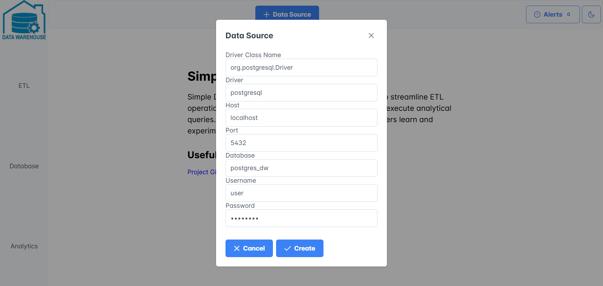
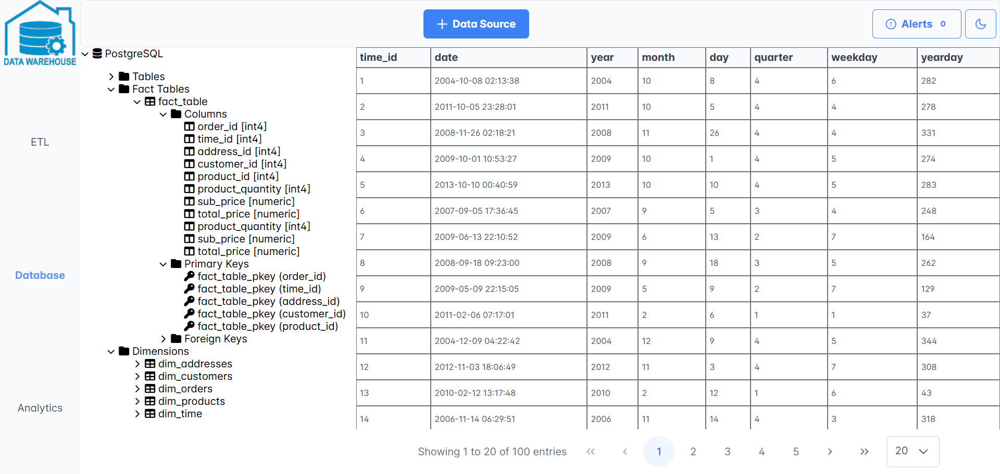

# Simple Datawarehouse

Simple Datawarehouse is a web application designed to streamline ETL operations using Apache NiFi, explore data tables
and execute analytical queries. It provides an intuitive user interface which allows users to learn and experiment with
data warehouses world.

## Table of Contents

- [Presentation](#presentation)
- [Instructions](#instructions)
    - [Requirements](#requirements)
    - [How to run application](#how-to-run-application)
    - [How to load Apache NiFi flow file](#how-to-load-apache-nifi-flow-file)
    - [Application Containers](#application-containers)
- [Database Schema](#database-schema)
- [Datawarehouse Schema](#datawarehouse-schema)
- [Development](#development)
    - [Requirements](#requirements-recommended)
    - [How to run backend](#how-to-run-backend)
    - [How to run frontend](#how-to-run-frontend)
    - [How to run Apache Nifi](#how-to-run-apache-nifi)
    - [How to clean databases](#how-to-clean-databases)

## Presentation

1. Welcome Page

<div align="center">
  
</div>

2. ETL view

<div align="center">
  
</div>

3. Datasource view

<div align="center">
  
</div>

4. Database view

<div align="center">
  
</div>

5. Database Table Lazy Pages

<div align="center">
  
</div>

6. Analytics view

<div align="center">
  
</div>

7. Analytics Table Scrolling

<div align="center">
  
</div>

8. SQL query view

<div align="center">
  
</div>

9. Analytics Results Download

<div align="center">
  
</div>

## Instructions

### Requirements:

- Cloned repository
- please ensure downloaded scripts from github have correct line endings (LF) especially under nifi/scripts/ path
  because sometimes git default configuration enforces system line endings when downloading files while Apache NiFi scripts needs to have LF
  line endings
- [Docker Desktop](https://docs.docker.com/get-started/get-docker/) installed
- docker command with minimum version 27.0.0 installed
- docker-compose command with minimum version 2.28.1 installed
- docker and docker-compose commands available
- please ensure installed version of Docker Desktop is updated to the newest version higher than 4.32.x

<div align="center">
  
</div>

- above requirements are due to fact that the file running application (docker-compose.yml) was configured using newer
  versions of Docker

### How to run application:

- run script

```
./scripts/startSimpleDatawarehouse.sh
```

- stop script

```
./scripts/stopSimpleDatawarehouse.sh
```

- uninstall script

```
./scripts/removeSimpleDatawarehouse.sh
```

Application UI will be available at http://localhost:80/

### How to load Apache NiFi flow file

1. Drag 'Process Group' into canvas and select nifi flow file.

```
resources/nifi_etl.json
```

<div align="center">
  
</div>

2. Enable all controller services required by NiFi components in that group.

<div align="center">
  
</div>

- ensure all services are enabled as below

<div align="center">
  
</div>

- How to navigate between groups:
    - Right click on process group and select 'Enter group'.
    - Alternatively right click anywhere and select 'Leave group'.


3. Start & Wait & Stop ETL processes in 'Dim Tables' group.

- below tables will be affected
    - dim_time
    - dim_products
    - dim_addresses
    - dim_customers
    - dim_orders

<div align="center">
  
</div>

4. Start & Wait & Stop ETL processes in 'Fact Table' group.

- below table will be affected
    - fact_table

<div align="center">
  
</div>

### Application Containers

<div align="center">
  
</div>

1. simple-datawarehouse-backend\
   Java Spring Boot based application responsible for executing SQL queries on datawarehouse.
2. simple-datawarehouse-frontend\
   Angular web application providing a user interface.
3. nifi\
   ETL (Extract, Transform, Load) tool.
4. postgres_ds\
   PostgreSQL database that serves as a data source for ETL processes.
5. postgres_dw\
   PostgreSQL database where the datawarehouse is modelled.
6. mysql_ds\
   MySQL database that serves as a data source for ETL processes.
7. mysql_dw\
   MySQL database where the datawarehouse is modelled.

## Database Schema

<div align="center">
  
</div>

## Datawarehouse Schema

<div align="center">
  
</div>

## Development

### Requirements (recommended):

- Java 21.0.2
- Maven 3.9.6
- Angular 17.3.9
- Node.js 20.11.0
- npm 10.2.4

### How to run backend:

- go to backend directory

```
cd simple-datawarehouse-backend
```

- run

```
mvn clean spring-boot:run
```

Backend will be available at http://localhost:8080/simple-datawarehouse

### How to run frontend:

- go to frontend directory

```
cd simple-datawarehouse-frontend
```

- run

```
npm install
```

```
ng serve
```

UI will be available at http://localhost:4200/

### How to run Apache NiFi:

- run script

```
./scripts/startNifi.sh
```

- stop script

```
./scripts/stopNifi.sh
```

- remove script

```
./scripts/removeNifi.sh
```

Apache Nifi will be available at http://localhost:4201/nifi

### How to clean databases:

- clean script

```
./scripts/cleanDatabases.sh
```

Database containers will be removed with associated volumes and started again.