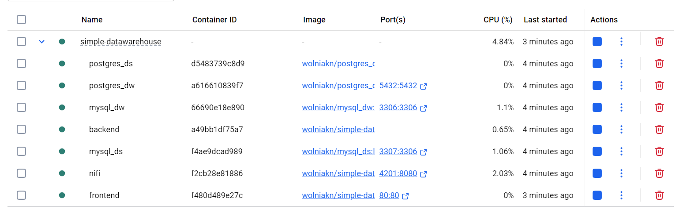
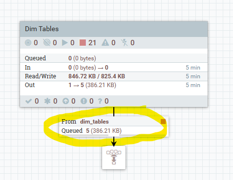

# Simple Datawarehouse

Simple Datawarehouse is a web application designed to streamline ETL operations using Apache NiFi, explore data tables
and execute analytical queries. It provides an intuitive user interface which allows users to learn and experiment with
data warehouses world.

## Table of Contents

- [Presentation](#presentation)
- [Instructions](#instructions)
    - [Requirements](#requirements)
    - [How to run application](#how-to-run-application)
    - [Application Containers](#application-containers)
    - [How to connect to database](#how-to-connect-to-database)
    - [How to load Apache NiFi flow file](#how-to-load-apache-nifi-flow-file)
    - [How to execute analytic query](#analytics)
- [Database Schema](#database-schema)
- [Datawarehouse Schema](#datawarehouse-schema)
- [Development](#development)

## Presentation

1. Welcome Page

<div align="center">
  
</div>

2. ETL view

<div align="center">
  
</div>

3. Datasource view

<div align="center">
  
</div>

4. Database view

<div align="center">
  
</div>

5. Database Table Lazy Pages

<div align="center">
  
</div>

6. Analytics view

<div align="center">
  
</div>

7. Analytics Table Scrolling

<div align="center">
  
</div>

8. SQL query view

<div align="center">
  
</div>

9. Analytics Results Download

<div align="center">
  
</div>

## Instructions

### Requirements:

- Cloning repository is not necessary
- Download [docker-compose.prod.yaml](https://raw.githubusercontent.com/nwolniak/simple-datawarehouse/refs/heads/main/docker-compose.prod.yaml) (Right-click and choose “Save link as...” to download)
- [Docker Desktop](https://docs.docker.com/get-started/get-docker/) installed
- docker command with minimum version 28.x.x installed

```
docker --version
```

- docker-compose command with minimum version 2.30.x installed

```
docker compose version
```

- please ensure installed version of Docker Desktop is updated to the newest version higher than 4.32.x

<div align="center">
  
</div>

- above requirements are due to fact that the file running application (docker-compose.yml) was configured using newer
  versions of Docker

### How to run application:

- Execute command from directory where docker-compose.prod.yaml file is located

```
docker compose -f docker-compose.prod.yaml up -d
```
- It will download all required prepopulated images from Docker Hub [repositories/wolniakn](https://hub.docker.com/repositories/wolniakn) and start containers.

<div align="center">
  
</div>


Application UI will be available at http://localhost:80/

### Application Containers

<div align="center">
  
</div>

1. simple-datawarehouse-backend\
   Java Spring Boot based application responsible for executing SQL queries on datawarehouse.
2. simple-datawarehouse-frontend\
   Angular web application providing a user interface.
3. simple-datawarehouse-nifi\
   ETL (Extract, Transform, Load) tool.
4. postgres_ds\
   PostgreSQL database that serves as a data source for ETL processes (prepopulated with data).
5. postgres_dw\
   PostgreSQL database where the datawarehouse is modelled (prepopulated with data schema).
6. mysql_ds\
   MySQL database that serves as a data source for ETL processes (prepopulated with data).
7. mysql_dw\
   MySQL database where the datawarehouse is modelled (prepopulated with data schema).

### How to connect to database

- Click +DataSource button at the top of the page

| Parameter         | postgres_ds           | postgres_dw           | mysql_ds                 | mysql_dw                 |
|-------------------|-----------------------|-----------------------|--------------------------|--------------------------|
| Driver Class Name | org.postgresql.Driver | org.postgresql.Driver | com.mysql.cj.jdbc.Driver | com.mysql.cj.jdbc.Driver |
| Driver            | postgresql            | postgresql            | mysql                    | mysql                    |
| Host              | host                  | host                  | host                     | host                     |
| Port              | 5433                  | 5432                  | 3307                     | 3306                     |
| Database          | postgres_ds           | postgres_dw           | mysql_ds                 | mysql_dw                 |
| Username          | user                  | user                  | user                     | user                     |
| Password          | password              | password              | password                 | password                 |

### How to load Apache NiFi flow file

1. Drag 'Process Group' into canvas and select nifi flow file located at

- Run ETL for postgresql or mysql datawarehouse to populate it for further processing.

```
simple-datawarehouse/resources/nifi_etl_postgresql.json

or

simple-datawarehouse/resources/nifi_etl_mysql.json
```

<div align="center">
  
</div>

2. Enable all controller services required by NiFi components in that group.

<div align="center">
  
</div>

- ensure all services are enabled as below

<div align="center">
  
</div>

- How to navigate between groups:
    - Right click on process group and select 'Enter group'.
    - Alternatively right click anywhere and select 'Leave group'.


3. Start & Wait & Stop ETL processes in 'Dim Tables' group.

- NiFi offers CRON or Schedulers only thats why we need to stop it manually when finished

- there should be 5 processed files in dim_tables output queue

- below tables will be affected
    - dim_time
    - dim_products
    - dim_addresses
    - dim_customers
    - dim_orders

<div align="center">
  
</div>

<div align="center">
  
</div>

4. Start ETL processes in 'Fact Table' group and wait for it to finish.

- below table will be affected
    - fact_table

<div align="center">
  
</div>

- it takes around 10 min to process due to enrichments section
- we can transform data between extract & load processes
- there should be 1 element in the last queue
- then stop Fact Table processing group

<div align="center">
  
</div>

### Analytics

- Datawarehouse should be populated with data from ETL process
- Connect to datawarehouse (click DataSource button)
- selectable dims and aggregates should be visible for creating analytic query.

<div align="center">
  
</div>

- choose columns and/or filters
- click Reload button to send query
- click Clear button to clear selected options
- click Download button to download results as csv file
- click Query button to lookup last send query as sql
- the resulting Table will be pivoted/unpivoted based on query

## Database Schema

<div align="center">
  
</div>

## Datawarehouse Schema

<div align="center">
  
</div>

## Development

See [DEVELOPMENT.md](./DEVELOPMENT.md)